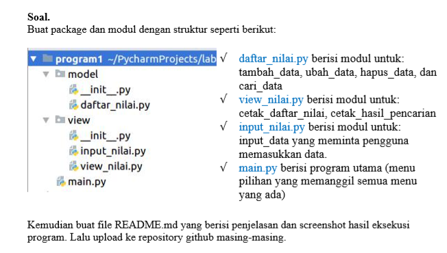
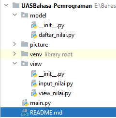
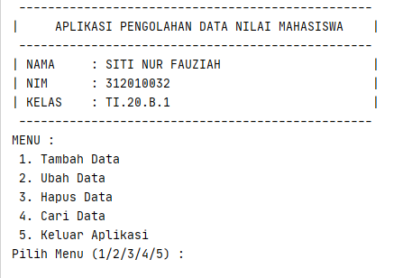

# UASBahasa-Pemrograman
Repository ini dibuat untuk memenuhi UAS Bahasa Pemrograman<br>

Nama    : Siti Nur Fauziah<br>
NIM     : 312010032<br>
Kelas   : TI.20.B.1<br>

## Jawaban soal UAS Bahasa Pemrograman Semester 1<br>
Pada repository ini saya akan menjawab soal dari Dosen Bahasa Pemrograman Membuat Package dan Modul seperti berikut : <br>
<br>

Untuk jawaban soal saya membuat Package dalam file python :<br>
<br>

Berikut isi source code file daftar_nilai.py, input_nilai.py, dan view_nilai.py atau klik link berikut [daftar_nilai.py](daftar_nilai.py) , [input_nilai.py](input_nilai.py) , [view_nilai.py](view_nilai.py)<br>
* daftar_nilai.py
```python
from prettytable import PrettyTable

# Fungsi : tambah_data, ubah_data, hapus_data, cari_data

x = PrettyTable()
tampunglist = {}


def tambah_data():
    print("========== TAMBAH DATA NILAI MAHASISWA ==========")
    tnama = input("Masukkan Nama Mahasiswa : ")
    tnim = input("Masukkan NIM Mahasiswa : ")
    tampunglist[tnama] = tnim


def hapus_data():
    print("========== HAPUS DATA NILAI MAHASISWA ==========")


def cari_data():
    print("========== CARI DATA NILAI MAHASISWA ==========")


def ubah_data(xsiapa):
    if xsiapa in tampunglist.keys():
        print("Data apa yang akan diubah ? : ")
        mhs = int(input(" 1. NIM \n 2. Nilai Tugas \n 3. Nilai UTS \n 4. Nilai UAS\n Pilih dengan angka (1/2/3/4) : "))
        if mhs == 1:
            ubahnim = input("Silahkan masukan NIM yang benar : ")
            i = 0
            vtug = tampunglist[xsiapa][1]
            vuts = tampunglist[xsiapa][2]
            vuas = tampunglist[xsiapa][3]
            vakh = tampunglist[xsiapa][4]
            tampunglist[xsiapa] = ubahnim, vtug, vuts, vuas, vakh
            x.field_names = ["No", "NAMA", " NIM", "TUGAS", "UTS", "UAS", "AKHIR"]
            for tdata in tampunglist.items():
                i += 2
                x.add_row([i, tdata[0], tdata[1][0], tdata[1][1], tdata[1][2], tdata[1][3], tdata[1][4]])
            print(x)
        elif mhs == 2:
            ubahtugas = int(input("Masukkan Nilai Tugas yang benar : "))
            i = 0
            vnim = tampunglist[xsiapa][0]
            vuts = tampunglist[xsiapa][2]
            vuas = tampunglist[xsiapa][3]
            vakh = tampunglist[xsiapa][4]
            tampunglist[xsiapa] = vnim, ubahtugas, vuts, vuas, vakh
            x.field_names = ["No", "NAMA", " NIM", "TUGAS", "UTS", "UAS", "AKHIR"]
            for tdata in tampunglist.items():
                i += 2
                x.add_row([i, tdata[0], tdata[1][0], tdata[1][1], tdata[1][2], tdata[1][3], tdata[1][4]])
            print(x)
        elif mhs == 3:
            ubahuts = int(input("Masukkan Nilai UTS yang benar : "))
            i = 0
            vnim = tampunglist[xsiapa][0]
            vtug = tampunglist[xsiapa][1]
            vuas = tampunglist[xsiapa][3]
            vakh = tampunglist[xsiapa][4]
            tampunglist[xsiapa] = vnim, vtug, ubahuts, vuas, vakh
            x.field_names = ["No", "NAMA", " NIM", "TUGAS", "UTS", "UAS", "AKHIR"]
            for tdata in tampunglist.items():
                i += 2
                x.add_row([i, tdata[0], tdata[1][0], tdata[1][1], tdata[1][2], tdata[1][3], tdata[1][4]])
            print(x)
        elif mhs == 4:
            ubahuas = int(input("Masukkan Nilai UAS yang benar : "))
            i = 0
            vnim = tampunglist[xsiapa][0]
            vtug = tampunglist[xsiapa][1]
            vuts = tampunglist[xsiapa][2]
            vakh = tampunglist[xsiapa][4]
            tampunglist[xsiapa] = vnim, vtug, vuts, ubahuas, vakh
            x.field_names = ["No", "NAMA", " NIM", "TUGAS", "UTS", "UAS", "AKHIR"]
            for tdata in tampunglist.items():
                i += 2
                x.add_row([i, tdata[0], tdata[1][0], tdata[1][1], tdata[1][2], tdata[1][3], tdata[1][4]])
            print(x)
        else:
            print("!!! === ERROR! Anda Memasukkan Pilihan yang Salah === !!!")
    else:
        print("!!! === ERROR! DATA TIDAK TERSEDIA === !!!")
```
* input_nilai.py
```python
from model.daftar_nilai import tampunglist
from prettytable import PrettyTable


# Fungsi : input_data

x = PrettyTable()
# tampunglist = {}


def input_nilai():
    print("---------- TAMBAH DATA MAHASISWA ---------")
    i = 0
    tnama = input("Masukkan Nama Mahasiswa : ")
    tnim = int(input("Masukkan Nomor Induk Mahasiswa : "))
    print("---------------- INPUT NILAI ---------------")
    ttugas = int(input("Masukkan Nilai Tugas Mahasiswa : "))
    tuts = int(input("Masukkan Nilai UTS Mahasiswa   : "))
    tuas = int(input("Masukkan Nilai UAS Mahasiswa   : "))
    takhir = 0.3 * float(ttugas) + 0.35 * float(tuts) + 0.35 * float(tuas)
    tampunglist[tnama] = tnim, ttugas, tuts, tuas, takhir
    x.field_names = ["NO", "NAMA", " NIM", "TUGAS", "UTS", "UAS", "AKHIR"]
    for tdata in tampunglist.items():
        i += 1
        x.add_row([i, tdata[0], tdata[1][0], tdata[1][1], tdata[1][2], tdata[1][3], tdata[1][4]])
    print(x)
```
* view_nilai.py
```python
# Fungsi : cetak_daftar_nilai, cetak_hasil_pencarian
```
* Dan yang terakhir yaitu main.py atau bisa klik [main.py](main.py)
```python
from model.daftar_nilai import ubah_data, hapus_data, cari_data
from view.input_nilai import input_nilai

print(" ------------------------------------------------- ")
print("|     APLIKASI PENGOLAHAN DATA NILAI MAHASISWA    |")
print(" ------------------------------------------------- ")
print("| NAMA     : SITI NUR FAUZIAH                     |")
print("| NIM      : 312010032                            |")
print("| KELAS    : TI.20.B.1                            |")
print(" ------------------------------------------------- ")
while True:
    print("MENU : \n 1. Tambah Data \n 2. Ubah Data \n 3. Hapus Data \n 4. Cari Data \n 5. Keluar Aplikasi")
    pilih = int(input("Pilih Menu (1/2/3/4/5) :  "))
    if pilih == 1:
        input_nilai()
    elif pilih == 2:
        ubah_data()
    elif pilih == 3:
        hapus_data()
    elif pilih == 4:
        cari_data()
    elif pilih == 5:
        print("========== ANDA KELUAR DARI APLIKASI ==========")
        break
    else:
        print("!!! === ERROR! Anda Memasukkan Pilihan yang Salah === !!!")
```
<b> Untuk tampilan awal program saat dijalakan akan seperti di bawah ini </b>
 <br>


